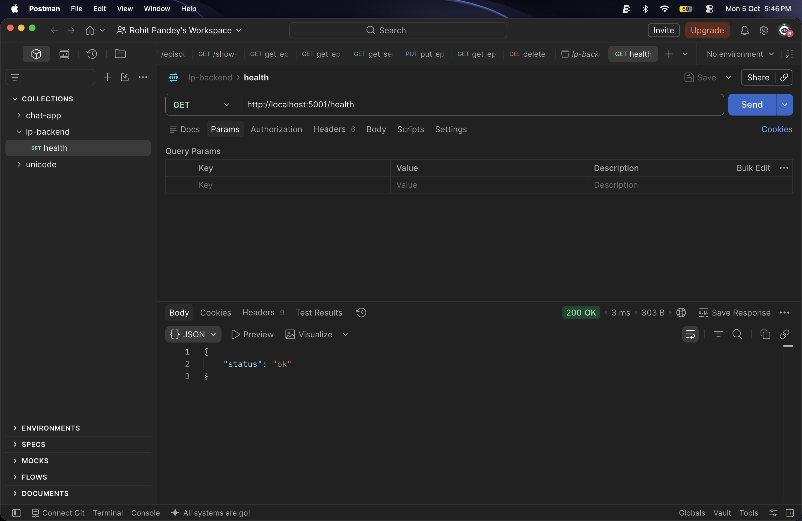
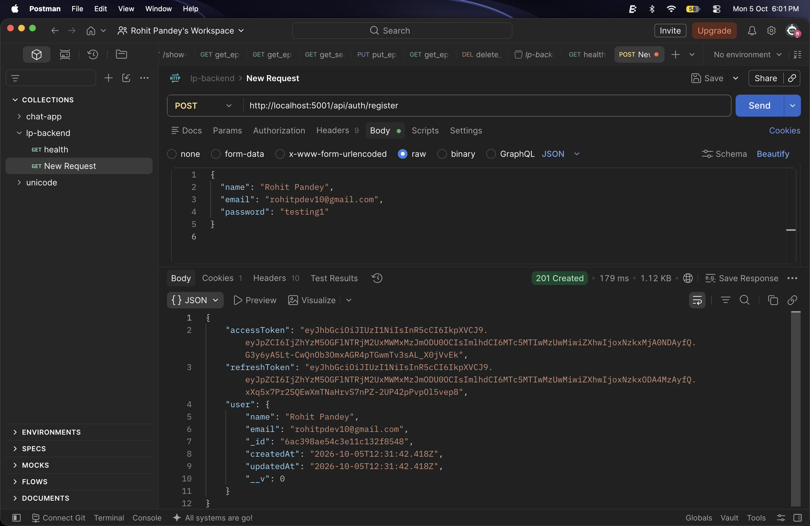
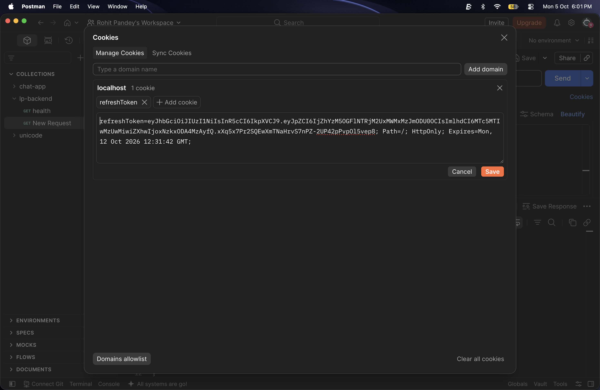
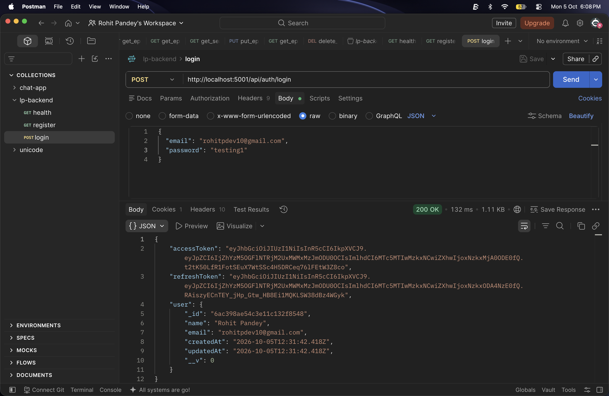
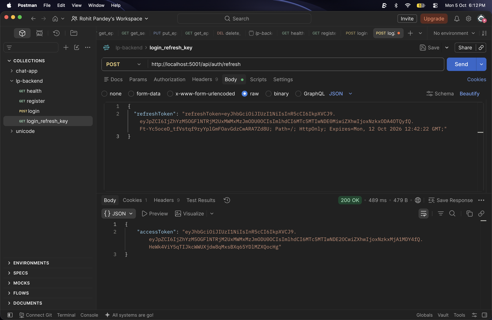
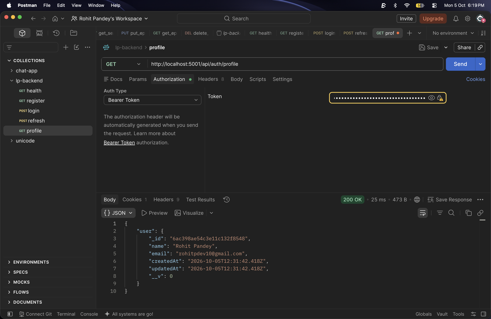

# Task 2 Authentication API

Express and MongoDB authentication API with bcrypt password hashing, short-lived access tokens, refresh tokens, protected profile access, and best-effort email notifications via Nodemailer.

## Setup

1. Install dependencies: `npm install`
2. Copy `.env.example` to `.env` and set MongoDB, JWT, and SMTP values.
3. Start development mode with `npm run dev` or production mode with `npm start`.

The server defaults to `http://localhost:5000` (or `http://localhost:5001` if configured in `.env`).

---

## API Endpoints

### Health Check

`GET /health`

Returns `200 OK` with `{ "status": "ok" }`.

### Register

`POST /api/auth/register`

```json
{
  "name": "Ada Lovelace",
  "email": "ada@example.com",
  "password": "secret123"
}
```

Returns `201 Created` with `accessToken`, `refreshToken`, and a password-free `user` object. The refresh token is also set as an HTTP-only cookie. Triggers a welcome email.

### Login

`POST /api/auth/login`

```json
{
  "email": "ada@example.com",
  "password": "secret123"
}
```

Returns `200 OK` with `accessToken`, `refreshToken`, and the `user` summary. Triggers a login notification email.

### Refresh Access Token

`POST /api/auth/refresh`

The preferred request uses the `refreshToken` HTTP-only cookie. API clients may alternatively send `{ "refreshToken": "<token>" }` in the JSON request body. Returns `200 OK` with a new `accessToken`.

### Protected Profile

`GET /api/auth/profile`

Header: `Authorization: Bearer <accessToken>`

Returns `200 OK` with the authenticated user profile, excluding the password.

### Error Handling

Errors return standard JSON payloads such as `{ "message": "Invalid email or password" }` with appropriate HTTP status codes (`400`, `401`, `404`, or `500`).

---

## Postman API Screenshots

### 1. Health Check


### 2. Register User


### 3. Register HTTP-Only Cookie


### 4. User Login


### 5. Refresh Access Token


### 6. Protected Profile Access


---

## Importable Postman Collection

Save the following JSON as `task2-auth.postman_collection.json`, then import it into Postman. Set the collection variable `baseUrl` to `http://localhost:5000` (or `http://localhost:5001`).

```json
{
  "info": {
    "name": "Task 2 Auth API",
    "schema": "https://schema.getpostman.com/json/collection/v2.1.0/collection.json"
  },
  "variable": [
    { "key": "baseUrl", "value": "http://localhost:5000" },
    { "key": "accessToken", "value": "" },
    { "key": "refreshToken", "value": "" }
  ],
  "item": [
    {
      "name": "Health Check",
      "request": {
        "method": "GET",
        "url": "{{baseUrl}}/health"
      }
    },
    {
      "name": "Register",
      "request": {
        "method": "POST",
        "header": [{ "key": "Content-Type", "value": "application/json" }],
        "body": {
          "mode": "raw",
          "raw": "{\n  \"name\": \"Ada Lovelace\",\n  \"email\": \"ada@example.com\",\n  \"password\": \"secret123\"\n}"
        },
        "url": "{{baseUrl}}/api/auth/register"
      }
    },
    {
      "name": "Login",
      "request": {
        "method": "POST",
        "header": [{ "key": "Content-Type", "value": "application/json" }],
        "body": {
          "mode": "raw",
          "raw": "{\n  \"email\": \"ada@example.com\",\n  \"password\": \"secret123\"\n}"
        },
        "url": "{{baseUrl}}/api/auth/login"
      }
    },
    {
      "name": "Refresh Access Token",
      "request": {
        "method": "POST",
        "header": [{ "key": "Content-Type", "value": "application/json" }],
        "body": {
          "mode": "raw",
          "raw": "{\n  \"refreshToken\": \"{{refreshToken}}\"\n}"
        },
        "url": "{{baseUrl}}/api/auth/refresh"
      }
    },
    {
      "name": "Get Profile",
      "request": {
        "method": "GET",
        "header": [{ "key": "Authorization", "value": "Bearer {{accessToken}}" }],
        "url": "{{baseUrl}}/api/auth/profile"
      }
    }
  ]
}
```
